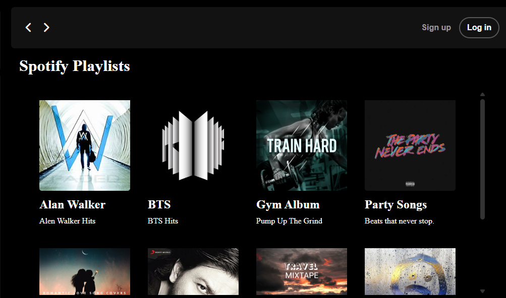
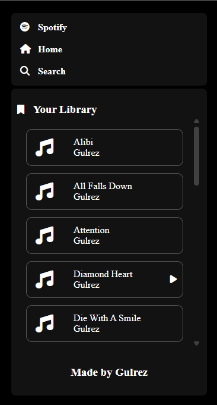
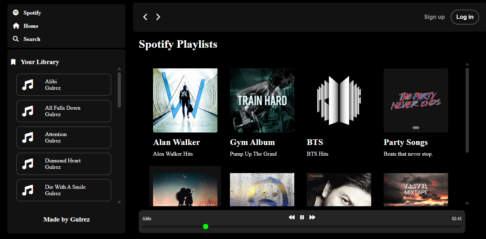
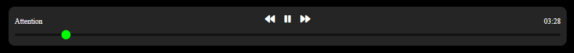

# 🎵 Spotify Clone

A sleek, responsive, and dynamic clone of the Spotify music streaming platform built using **HTML**, **CSS**, and **JavaScript**.

---

## 🚀 Features

- 🎧 **Music Player**  
  Play, pause, skip forward/backward, and seek through songs using an intuitive player bar.

- 📁 **Dynamic Album Loader**  
  Automatically detects albums from folders and displays them with cover art, title, and description.

    
  *Above: Albums displayed dynamically from folder structure*

- 📝 **Song List Rendering**  
  Loads and lists songs dynamically from the selected album.

    
  *Above: Songs are listed when an album is selected (under "Your Library")*

- 🎨 **Modern UI Design**  
  Clean black-themed layout, scrollable playlists, hover effects, and Font Awesome icons for a real Spotify feel.

    
  *Above: A snapshot of the Spotify-like interface*

- 💾 **Metadata Display**  
  Displays the current song name and total duration in the player.

    
  *Above: Song metadata like name and duration shown in the playbar*

---

## 📁 Folder Structure

```
project-root/
│
├── index.html # Main HTML file
├── style.css # All styling and layout
├── script.js # JavaScript logic for player and dynamic rendering
├── utility.css # utility classes
└── songs/ # Root folder containing music albums
├── album1/
│ ├── track1.mp3
│ ├── track2.mp3
│ ├── info.json # Contains album title, description, and cover image name
│ └── cover.jpg/png
├── album2/
└── ...
```

### Sample `info.json` (in each album folder)

```json
{
  "title": "Happy Hits",
  "description": "Hits to boost your mood and fill you with happiness.",
  "cover": "cover.jpg"
}
```

## 🛠️ How to Run

1. **Clone this repository** or download the source code.
2. Make sure you have a **local server** (like VS Code Live Server or Python's `http.server`) running, since the project fetches data via HTTP.
3. Place your `.mp3` files and `info.json` inside folders under `/songs/`.
4. Open `index.html` in your browser via the server URL (e.g., `http://127.0.0.1:5500/`).
5. 🎧 Enjoy your own music streaming experience!

---

## ✅ To-Do

- [ ] Responsive design improvements for mobile  
- [ ] Add volume control  
- [ ] Playlist queue and shuffle support  
- [ ] User authentication (future scope)

---

## 🙌 Credits

- Developed by **Gulrez Mansuri**
- Icons from [Font Awesome](https://fontawesome.com)
- Inspired by [Spotify](https://www.spotify.com)

---

> **Disclaimer**: This is a personal project for educational purposes and is not affiliated with or endorsed by Spotify.
